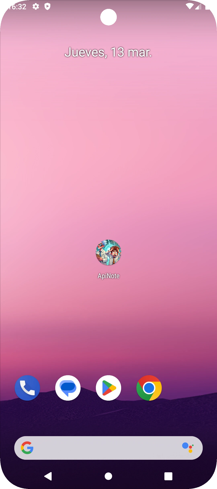
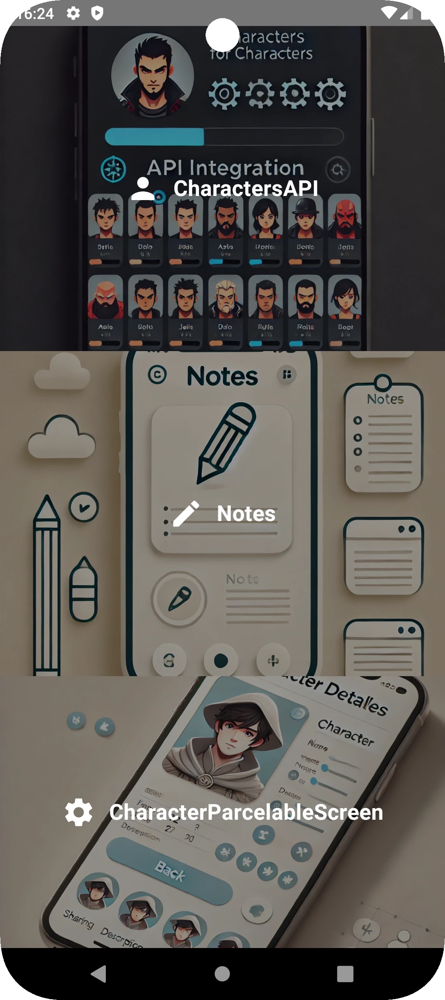
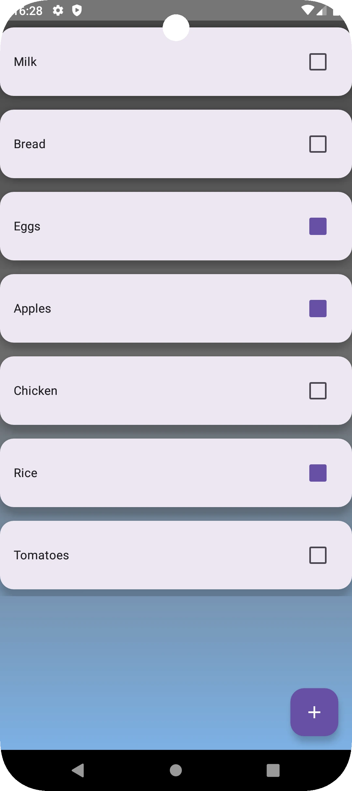
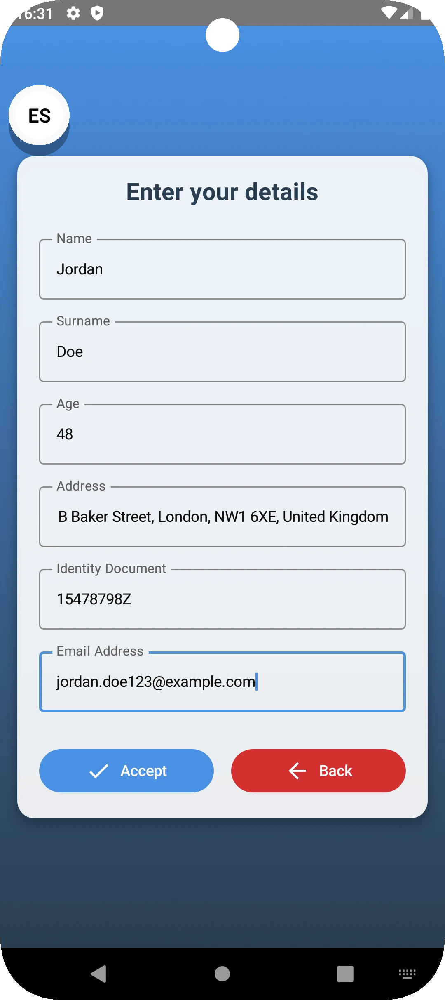
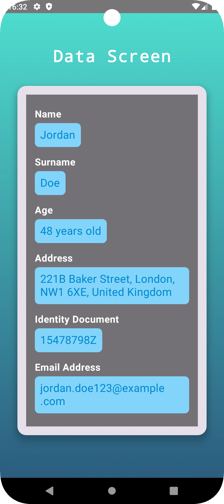

# 📱 Jetpack Compose App

🚀 **Aplicación desarrollada con Jetpack Compose siguiendo el patrón MVVM.**  
Esta app tiene tres funcionalidades principales:

1️⃣ **Consulta a una API**: Obtiene y muestra datos de una API externa utilizando Retrofit y Paging3.  
2️⃣ **Gestión de Notas**: Permite agregar, editar y eliminar notas almacenadas localmente con Room y Flow.  
3️⃣ **Paso de Datos entre Pantallas**: Implementa el paso de datos usando `GenericInfoType<NavType>`, una forma más flexible, mejor que el getParcelable() genérico.

---

## 📌 Tecnologías y Librerías Utilizadas

| **Tecnología**              | **Versión** |
|-----------------------------|------------|
| 🎯 **Kotlin**               | 2.0.0      |
| 🏗️ **Jetpack Compose (BOM)** | 2024.04.01 |
| 🔗 **Retrofit (Networking)** | 2.9.0      |
| 📚 **Room (Base de Datos)**  | 2.6.1      |
| 🔄 **Flow (Reactividad con Room)** | Incluido en Kotlin Coroutines |
| 📦 **Paging3 Compose**        | 3.3.0      |
| 🚀 **Lifecycle + ViewModel** | 2.8.7      |
| 🛠️ **Hilt (Inyección de Dependencias)** | 2.49 |
| 🔄 **Navigation Compose**    | 2.8.2      |
| 🎭 **Parcelize (Paso de Datos)** | 1.8.10 |
| 🎭 **Entre otras**          |        |
---

## 📸 Capturas de Pantalla

_Añade imágenes aquí para hacer el README más atractivo._  
Ejemplo:

---

## ⚙️ Arquitectura

La aplicación sigue el **patrón MVVM (Model-View-ViewModel)** para garantizar una estructura modular y escalable.  

- **Model:** Define los datos y su estructura.  
- **ViewModel:** Gestiona la lógica de negocio y el estado de la UI.  
- **View (Jetpack Compose):** Renderiza los datos y responde a eventos del usuario.  

📌 **Flujo de la aplicación:**  
1. La app obtiene datos de una API con Retrofit y los muestra en una lista con **Paging 3**.  
2. El usuario puede crear notas y almacenarlas en **Room**, utilizando **Flow** para obtener cambios en tiempo real.  
3. Se pasa información entre pantallas mediante `GenericInfoType<NavType>` en Navigation Compose.  

---

## 📝 Notas Importantes

### ⚠️ Uso de `GenericInfoType<NavType>` en el Paso de Datos
Para pasar datos entre pantallas de manera más segura y flexible, en lugar de usar el enfoque tradicional de `Parcelable`, se utiliza un tipo genérico basado en `NavType`.

---

### 📌 Uso de **Flow** con **Room**
La app utiliza `Flow` en los **ViewModels** para observar cambios en la base de datos en tiempo real. Además, `repeatOnLifecycle` se usa para recolectar `Flow` solo cuando la pantalla está activa, lo que optimiza el uso de recursos.

Este enfoque permite que la interfaz esté siempre actualizada sin necesidad de recargar manualmente los datos.

